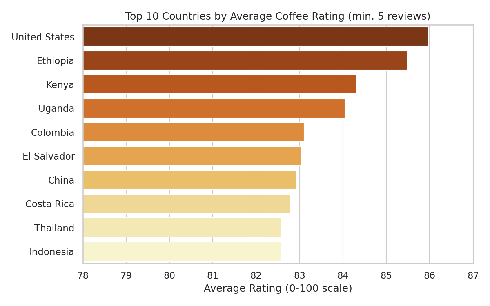
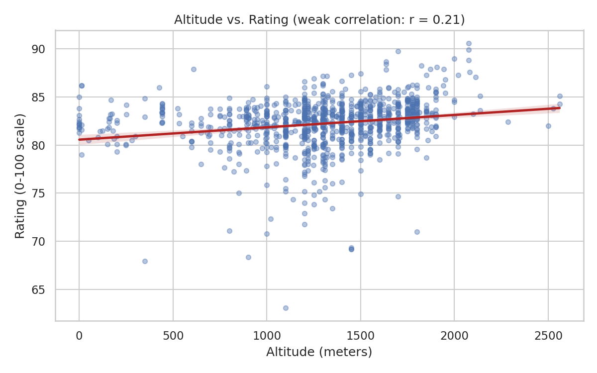
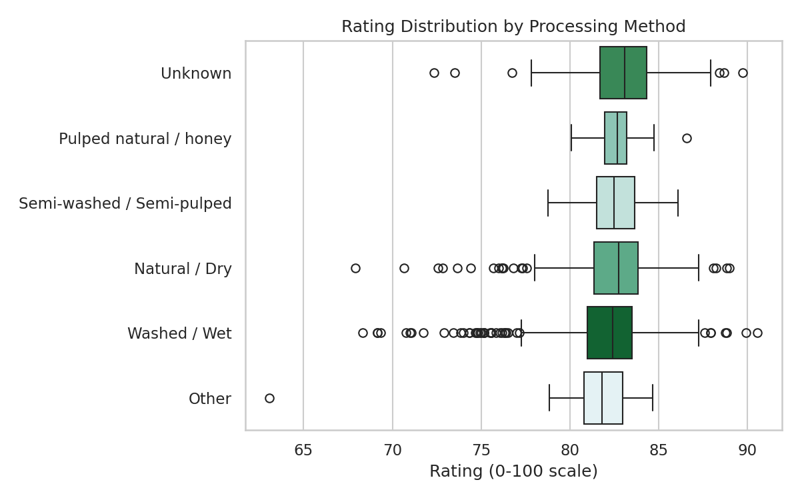
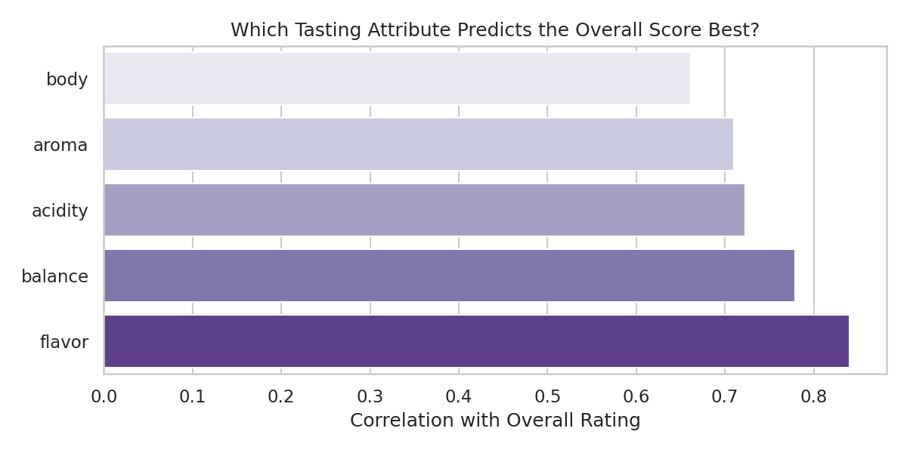

# Coffee Review Explorer ☕

A first data science project exploring what actually predicts a coffee's
quality rating, using real professional cupping data from the Coffee
Quality Institute.

## The Question

Coffee culture is full of assumptions — high altitude means better beans,
washed processing is more "correct," etc. Do these hold up in real
professional review data?

## Data

[Coffee Quality Institute reviews](https://github.com/jldbc/coffee-quality-database),
via the [TidyTuesday project](https://github.com/rfordatascience/tidytuesday/blob/main/data/2020/2020-07-07/readme.md) —
1,339 professionally graded Arabica and Robusta coffees, each scored 0-100
across attributes like aroma, flavor, acidity, body, and balance.

## Project Structure

```
coffee-review-explorer/
├── data/
│   ├── coffee_ratings.csv        # raw data
│   └── coffee_ratings_clean.csv  # cleaned (generated by clean_data.py)
├── src/
│   ├── clean_data.py             # cleaning + preprocessing
│   ├── analyze.py                # groupby analysis, correlations
│   └── visualize.py              # generates charts below
├── output/                       # generated charts
├── requirements.txt
└── README.md
```

## How to Run

```bash
pip install -r requirements.txt
python src/clean_data.py    # cleans raw data -> data/coffee_ratings_clean.csv
python src/analyze.py       # prints findings to console
python src/visualize.py     # saves charts to output/
```

## Findings

### 1. Ethiopia and Kenya lead the pack

Among countries with at least 5 reviews, coffee from Ethiopia and Kenya
consistently rates highest — a result that lines up with their reputation
in specialty coffee circles.



### 2. Altitude is a weak predictor, despite the hype

"Grown at high altitude" is a common selling point, but in this data,
altitude only weakly correlates with rating (**r = 0.21**). Good beans
come from a wide range of elevations.



### 3. Processing method barely moves the needle

Washed, natural, and honey-processed coffees all land in a similar rating
range — processing method changes *flavor character* more than it
changes overall *quality*.



### 4. Flavor, not aroma, drives the overall score

Of all the tasting sub-scores, **flavor** correlates most strongly with
the total rating (r = 0.84), followed by balance and acidity. Aroma and
body matter, but less.



## What I'd Explore Next

- Predict `total_cup_points` from the sub-scores using linear regression
- Look at whether specific `variety` (Bourbon, Typica, etc.) matters
- Bring in coffee shop menu/price data to compare quality vs. cost

## Tools Used

Python, pandas, matplotlib, seaborn
